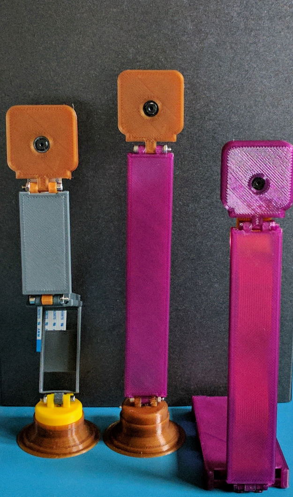

# Modular Raspberry Pi Camera Cases

Cases for the Raspberry Pi foundation's camera. v1/v2 are supported.

**Note**: This case needs M2.5 screws and nuts! The bill of materials with a source for getting these is listed below.

## Extrusion Width == 0.48mm

This case is also designed around an extrusion width of 0.48mm for strength (using a 0.4mm E3D nozzle) around small areas and parts. It makes a huge difference, so if the case isn't quite right, try adjusting the extrusion width.

## Assembly / Printing

Choose one of the cases below (they're plated together according to filename). They're also available separately for expansion (if a larger arm is desired, more/less sections, etc).

## Bill of Materials

This BOM lists the amount of screws for each setup. In reality, everything is usually sold in 25+ quantity packs, so just buy M2.5 screws and M2.5 hex nuts. There is extra spacing to use nylock nuts instead if desired.

Of course, if you're set on doing so, threading a bit of filament through the
holes and gluing everything together can work just as well (if no future adjustments are desired).

#### Pi Zero Case + Long Arm

To split these for arranging on a bed in Slic3r, use the 'Split' option at the top [next to scale/cut]. These files include the **v2 camera enclosure by default**. The bottom-most stand is separate as well.

* File: [plated_pi_zero_case.stl](plated_pi_zero_case.stl) [purple, far right in the photos]
* 2x M2.5 x 16mm screw
* 2x M2.5 hex nut

#### Long Arm

* File: [plated_long_arm.stl](plated_long_arm.stl) [purple with brown/bronze top, center]
* 2x M2.5 x 16mm screw
* 2x M2.5 hex nut

#### Multi-jointed Arm

* File: [plated_multi_arm.stl](plated_multi_arm.stl) [yellow base, gray and brown/bronze top, left]
* 4x M2.5 x 16mm screw
* 4x M2.5 hex nut

#### Stand

* File: [Stand.stl](Stand.stl) [Brown/Bronze bottom in pictures]
* 1x: M2.5 x 16mm screw (pushed in through the top or bottom before joining
  with the smaller base [yellow in the picture])

### Hardware source

(I don't have a good source for a metric hex key, but an appropriately sized one should be in many repair kits and multi-tools)

#### Trimcraft Aviation RC

* M2.5 Plain Hex Nut (25 pcs): https://www.trimcraftaviationrc.com/index.php?route=product/product&product_id=137
* M2.5 x 16mm Socket Cap Screw (25 pcs): https://www.trimcraftaviationrc.com/index.php?route=product/product&product_id=199

##### Materials Used (1.75mm PLA)

(These are the various types of PLA used in the photo above; basically a mix-and-match of whatever was loaded into the machine on the day that these were made)

* Purple: Ultimachine Purple Translucent PLA

* Yellow: Prusa PLA (Fillamentum)

* Brown: Proto-pasta High Performance HTPLA - Aromatic Coffee

* Gray: Atomic Filament Extreme Impact Gun Metal Gray v2 (a flex test of the impact modifier is present on the far left casing)
